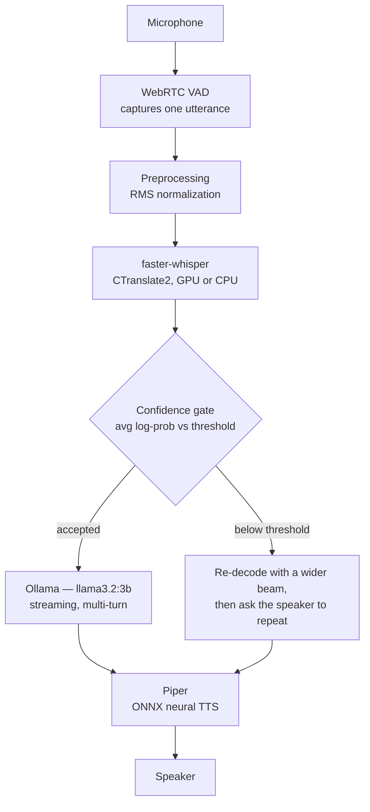

# Local Voice Chatbot

A speech-to-text → LLM → text-to-speech assistant that runs entirely on the local
machine. There are no cloud APIs and no network calls at inference time. In front
of Whisper the pipeline adds a preprocessing and confidence-gating layer, so
speech delivered under unusual modulation — whispered, shouted, fast, slow, or
off-pitch — is either transcribed reliably or explicitly rejected, rather than
passed downstream as a confident mistranscription.

[](https://github.com/Sandeepsrinivasan-14/voice-chatbot/actions/workflows/tests.yml)


## Background

Whisper and comparable STT models are trained mostly on clean, conversational
speech. Under strong modulation the input drifts away from that distribution, and
the model tends to fail by producing a fluent but wrong transcription rather than
by signalling uncertainty. A wrong transcription that looks confident is the worst
case for a voice agent: it feeds bad input to the LLM, and the user gets a
plausible answer to a question they never asked.

Two mechanisms address this:

- **RMS normalization** rescales the loudness of the incoming audio to a fixed
  target before decoding, so a whisper and a shout reach Whisper at a comparable
  level.
- **Confidence gating** reads the average token log-probability from the decode.
  Below a configurable threshold the utterance is re-decoded with a wider beam,
  and if it still fails the assistant asks the speaker to repeat instead of
  continuing.

## How it works



Every stage runs on local CPU or GPU. The only process boundary is a loopback
HTTP call to Ollama on `localhost:11434`.

## Stack

| Stage | Choice | Why |
| :--- | :--- | :--- |
| STT | faster-whisper | CTranslate2 build of Whisper. Runs on CPU with no extra packages, and uses roughly a quarter of the VRAM of the reference implementation at similar accuracy — which is what lets it sit next to the LLM on a 4 GB GPU. |
| LLM | Ollama running `llama3.2:3b` | Handles GGUF quantization and GPU offload with no extra setup. Chosen over `qwen2.5:3b-instruct`, which scored comparably but read less naturally when spoken aloud. |
| TTS | Piper | Small ONNX voice model; synthesizes faster than real time on CPU. |
| DSP | librosa | Used for RMS measurement, pitch tracking, and onset detection in the preprocessing stage. |

## The modulation-robustness layer

### Preprocessing — [`src/preprocessing.py`](src/preprocessing.py)

- RMS/volume normalization, applied to every utterance (`TARGET_RMS = 0.1`).
- Pitch and tempo outlier detection: fundamental-frequency and onset-density
  tracking. Detection and logging only — the correction step is off by default
  (`ENABLE_PITCH_CORRECTION = ENABLE_SPEED_CORRECTION = False`). See
  [Benchmark](#benchmark) for why.

### Confidence gate — [`src/confidence_check.py`](src/confidence_check.py)

- `evaluate()` maps an average log-probability to one of three decisions:
  `ACCEPTED`, `RETRY_MORE_BEAMS`, or `ASK_TO_REPEAT`.
- The threshold defaults to `-0.6` (`CONFIDENCE_THRESHOLD`). The score is not a
  calibrated probability and its distribution shifts with speaker and microphone,
  so re-tune it against your own `logs/confidence_log.csv`.
- Every decision is appended to that CSV, with the transcription, the score, the
  beam size used, and the attempt number.

### Response shaping — [`src/pipeline.py`](src/pipeline.py)

The system prompt constrains the LLM to one to three plain sentences, with no
Markdown tables, lists, or symbols that a TTS engine would read aloud awkwardly.

## Benchmark

The set is 25 recordings: five command words (`yes`, `no`, `stop`, `help`,
`start`), each spoken five ways (normal, whispered, shouted, slow, fast), by one
speaker on one microphone. Each clip is transcribed twice — raw, and through the
preprocessing layer — and scored against the expected word.

| Modulation | Raw | With preprocessing |
| :--- | :---: | :---: |
| Normal | 5 / 5 | 5 / 5 |
| Whispered | 5 / 5 | 5 / 5 |
| Shouted | 5 / 5 | 5 / 5 |
| Slow | 4 / 5 | 4 / 5 |
| Fast | 5 / 5 | 5 / 5 |
| **Total** | **24 / 25 (96%)** | **24 / 25 (96%)** |

Raw data: [`data/results/benchmark_results.csv`](data/results/benchmark_results.csv).
Chart: [`data/results/accuracy_comparison.png`](data/results/accuracy_comparison.png).
Reproduce with `python src/benchmark.py`.

What the numbers say: on this set RMS normalization holds accuracy level — it
neither helps nor hurts, because Whisper already handles these five words well
once they are loud enough. The one persistent error (`help`, spoken slowly,
transcribed as `"L"`) is not a loudness problem, and normalization does not fix
it.

An earlier version of the layer also pitch-shifted and time-stretched outliers.
On these single-word clips that dropped the overall score to 48%: onset density is
a poor tempo estimate for a clip containing a single word, so the "correction" was
warping audio that was already fine. Pitch and speed correction were switched off
by default; detection and logging still run. A regression test pins the 96%
parity so this cannot silently come back.

## Setup

Requires Python 3.11 and a running [Ollama](https://ollama.com/) install.

```bash
git clone https://github.com/Sandeepsrinivasan-14/voice-chatbot.git
cd voice-chatbot

python -m venv venv
source venv/bin/activate            # Windows: .\venv\Scripts\activate

pip install -r requirements.txt         # CPU
# pip install -r requirements-gpu.txt   # GPU: CUDA 12.x, ~1.3 GB of wheels
```

Pull the model:

```bash
ollama pull llama3.2:3b
```

Check the install — reports on CUDA, faster-whisper, Ollama, and Piper:

```bash
python verify_setup.py
```

Every tunable has a default in [`src/config.py`](src/config.py). To override one,
copy `.env.example` to `.env` and edit it; nothing in `.env` is required to run.

## Running it

### Browser UI

```bash
python src/chat_web.py       # then open http://localhost:5006
```

Streaming responses, a per-message confidence indicator, multi-turn history, and
playback of the synthesized reply. To serve it through Waitress instead of Flask's
development server:

```powershell
$env:PRODUCTION = 1; python src/chat_web.py
```

### Terminal

```bash
python src/cli.py
```

Voice activity detection drives capture — speak, then pause.

## Tests

```bash
pytest       # 42 tests; the GPU, Ollama, and the microphone are all mocked
```

CI runs the same suite plus `ruff` on every push
([`.github/workflows/tests.yml`](.github/workflows/tests.yml)).

## Windows and CUDA

On Windows, CTranslate2 resolves its CUDA DLLs (`cublas64_12.dll`,
`cudnn64_9.dll`) through `LoadLibrary`, which ignores `os.add_dll_directory()`.
[`src/cuda_dlls.py`](src/cuda_dlls.py) works around this by prepending the
`nvidia-cublas-cu12` and `nvidia-cudnn-cu12` wheel directories to `PATH` before
`faster_whisper` is imported, so GPU inference works without a system-wide CUDA
install. It has to be imported first; the entry-point scripts already do that.

## Scope

Included: centralized configuration, the mocked test suite and CI, a Waitress
server option, rotating file logs, JSON error responses with a 25 MB upload cap on
the web endpoints, and retry-with-backoff on the Ollama client.

Not included, by choice: authentication, multi-user support, containerization, and
packaging. This is a single-user application meant to run on the machine in front
of you.

## Project layout

```
src/
  pipeline.py          orchestration: capture, GPU/CPU fallback, streaming LLM, TTS playback
  preprocessing.py     RMS normalization; pitch/speed detection
  confidence_check.py  log-probability gate and CSV audit log
  config.py            frozen Config dataclass, .env support
  cuda_dlls.py         Windows CUDA DLL path fix
  chat_web.py          browser chat UI (web_chat/)
  record_web.py        dataset recorder UI (web_recorder/)
  cli.py               terminal interface with live VAD
  benchmark.py         raw-vs-preprocessed accuracy benchmark
tests/                 42 pytest tests, fully mocked
docs/                  functional and technical specification (PDF + HTML sources)
```

## License

MIT. See [LICENSE](LICENSE).
