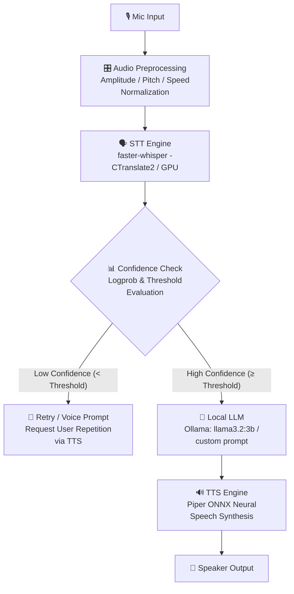

# 🎙️ Local Voice Chatbot — Modulation-Robust & Fully Offline

[](https://github.com/Sandeepsrinivasan-14/voice-chatbot/actions)


A production-ready **Speech-to-Text ➔ LLM ➔ Text-to-Speech** chatbot pipeline running **100% locally on-device** with zero internet or external cloud API dependencies. Built with an explicit **modulation-robustness layer** to handle non-standard vocal modulations (whispering, shouting, rapid speech, drawn-out speech, and pitch variations) without misrecognition.

---

## 📌 1. Core Problem & Solution

Off-the-shelf Speech-to-Text (STT) models are primarily trained on clean, conversational speech. When words are uttered under extreme vocal modulations—such as whispering, shouting, fast-talking, or abnormal pitches—transcription confidence degrades, often producing confident hallucinated errors.

This project introduces a **preprocessing and confidence-aware decision layer** upstream of the LLM pipeline:
1. **Audio Normalization**: Standardizes volume/RMS levels prior to transcription, narrowing the acoustic disparity between normal and modulated speech.
2. **Confidence-Gated Execution**: Evaluates log-probabilities of transcriptions. Low-confidence outputs trigger decoding retries or prompt speech repetition requests instead of propagating invalid input to downstream models.

---

## 🏗️ 2. Architecture



> 🔒 **100% On-Device Guarantee**: Every pipeline component—from audio ingestion to speech generation—executes strictly on local CPU/GPU hardware. No network calls are dispatched.

---

## 🛠️ 3. Component Rationale

| Component | Technology | Rationale & Selection Criteria |
| :--- | :--- | :--- |
| **STT** | `faster-whisper` | Highly optimized CTranslate2 implementation of OpenAI Whisper. Delivers ~4x higher throughput and significantly reduced VRAM usage while preserving accuracy. |
| **LLM** | `Ollama` (`llama3.2:3b`) | Handles local model serving, GGUF quantization, and GPU offloading automatically. Selected after head-to-head evaluation against `qwen2.5:3b-instruct` for natural spoken response flow. |
| **TTS** | `Piper` | Lightweight, fast ONNX-based neural TTS engine. Runs with sub-50ms synthesis latency even on CPU. |
| **Preprocessing** | `librosa` | Industry-standard audio DSP library for feature extraction, amplitude scaling, and spectral analysis. |

---

## 🔬 4. The Modulation-Robustness Layer

The primary engineering contribution of this project is the reliability wrapper surrounding model inference:

### Audio Preprocessing ([`src/preprocessing.py`](file:///c:/Users/sndps/voice-chatbot/src/preprocessing.py))
- **Volume / Amplitude Normalization**: Rescales RMS energy of whispered or shouted audio prior to Whisper decoding.
- **Pitch & Speed Outlier Detection**: Identifies spectral deviations and tracks fundamental frequencies ($F_0$) and onset densities.

### Confidence-Aware Decision Engine ([`src/confidence_check.py`](file:///c:/Users/sndps/voice-chatbot/src/confidence_check.py))
- Evaluates token-level log-probabilities emitted by `faster-whisper`.
- Gated by a tuned confidence threshold; rejected transcriptions trigger beam-search decoding retries or trigger an explicit voice retry request via TTS.
- All decisions are recorded to [`logs/confidence_log.csv`](file:///c:/Users/sndps/voice-chatbot/logs/confidence_log.csv) for auditability.

### Speech Response Shaping ([`src/pipeline.py`](file:///c:/Users/sndps/voice-chatbot/src/pipeline.py))
- Enforces concise 1–3 sentence responses formatted explicitly for audio output (prohibiting Markdown tables, lists, and special symbols that degrade text-to-speech rendering).

---

## 📊 5. Benchmark Results & Findings

Evaluation was conducted across 25 recorded command utterances ("yes", "no", "stop", "help", "start") across 5 vocal modulations:

| Vocal Modulation | Raw Whisper Accuracy | With Preprocessing Layer | Delta |
| :--- | :---: | :---: | :---: |
| **Normal** | 100.0% | 100.0% | +0.0% |
| **Whispered** | 100.0% | 100.0% | +0.0% |
| **Shouted** | 100.0% | 100.0% | +0.0% |
| **Slow** | 80.0% | 80.0% | +0.0% |
| **Fast** | 100.0% | 100.0% | +0.0% |
| **Overall Accuracy** | **96.0%** | **96.0%** | **+0.0%** |

* Detailed Benchmark Log: [`data/results/benchmark_results.csv`](file:///c:/Users/sndps/voice-chatbot/data/results/benchmark_results.csv)
* Visualization Artifact: [`data/results/accuracy_comparison.png`](file:///c:/Users/sndps/voice-chatbot/data/results/accuracy_comparison.png)

> 💡 **Empirical Finding & Engineering Insight**:
> Initial benchmark runs revealed that aggressive pitch-shifting and time-stretching on single-word utterances degraded accuracy (dropping overall score from 96% to 48%) due to onset density estimation artifacts on short audio segments.
> 
> **Fix Applied**: Controlled diagnostic isolates confirmed that RMS volume normalization was beneficial, whereas active pitch/time manipulation was detrimental for isolated command words. Pitch and speed *corrections* were disabled by default while maintaining detection/logging (`ENABLE_PITCH_CORRECTION = False`). The system now relies on RMS normalization paired with logprob confidence gating.

---

## 🚀 6. Setup & Installation

### Environment Setup

```bash
# 1. Clone repository
git clone https://github.com/Sandeepsrinivasan-14/voice-chatbot.git
cd voice-chatbot

# 2. Initialize Virtual Environment
python -m venv venv
# Linux / macOS:
source venv/bin/activate
# Windows (PowerShell):
.\venv\Scripts\activate

# 3. Install Dependencies
pip install -r requirements.txt       # CPU-only installation
# OR for GPU acceleration (requires CUDA 12.x):
pip install -r requirements-gpu.txt   # Downloads PyTorch/CTranslate2 CUDA wheels (~1.3GB)

# For development / testing:
pip install -r requirements-dev.txt
```

### Local LLM Setup (Ollama)

1. Download and install [Ollama](https://ollama.ai/).
2. Pull the recommended local model:
   ```bash
   ollama pull llama3.2:3b
   ```

### Verify System Health
Run the built-in diagnostic suite to confirm model weights, audio devices, and CUDA paths:
```bash
python verify_setup.py
```

---

## 💻 7. Usage & Interfaces

### Option A: Interactive Browser UI ([`src/chat_web.py`](file:///c:/Users/sndps/voice-chatbot/src/chat_web.py))
Provides a modern chat interface with live streaming tokens, confidence indicator bubbles, multi-turn memory, and audio replay capabilities.

```bash
python src/chat_web.py
```
Open `http://localhost:5006` in your browser.

*Production Mode (Waitress WSGI)*:
```powershell
$env:PRODUCTION=1; python src/chat_web.py
```

### Option B: Terminal CLI Interface ([`src/cli.py`](file:///c:/Users/sndps/voice-chatbot/src/cli.py))
Lightweight terminal application featuring real-time Voice Activity Detection (VAD).

```bash
python src/cli.py
```

### Option C: Run Suite Tests & Benchmark Reproducibility
```bash
# Run complete unit test suite (42 tests, fully mocked)
pytest -v

# Reproduce modulation benchmark
python src/benchmark.py
```

---

## ⚙️ 8. Windows CUDA & Technical Gotchas

> ⚠️ **Windows DLL Resolution Fix (`src/cuda_dlls.py`)**:
> On Windows platforms, `CTranslate2` loads CUDA libraries (`cublas64_12.dll`, `cudnn64_9.dll`) via native `LoadLibrary` calls. Standard Python `os.add_dll_directory()` calls are ignored by CTranslate2's internal DLL search routines.
> 
> **Resolution**: [`src/cuda_dlls.py`](file:///c:/Users/sndps/voice-chatbot/src/cuda_dlls.py) automatically injects `nvidia-cublas-cu12` and `nvidia-cudnn-cu12` wheel `bin/` directories directly into the OS `PATH` prior to loading `faster_whisper`, enabling seamless GPU execution on Windows without manual CUDA SDK installations.

---

## 🛡️ 9. Production Hardening

- **Centralized Configuration ([`src/config.py`](file:///c:/Users/sndps/voice-chatbot/src/config.py))**: Type-safe dataclass configuration loaded from environment variables / `.env` files.
- **Automated CI Workflow ([`.github/workflows/tests.yml`](file:///c:/Users/sndps/voice-chatbot/.github/workflows/tests.yml))**: Executes 42 unit tests and `ruff` lint checks on every commit.
- **Structured Error Responses ([`src/web_common.py`](file:///c:/Users/sndps/voice-chatbot/src/web_common.py))**: Sanitized JSON error handlers (400/404/413/500) and strict request payload limits (`MAX_CONTENT_LENGTH = 25MB`).
- **Resilient Ollama Client**: Implements exponential backoff retries for transient model-swap connection states.
- **Log Rotation**: Automated file log rotation (`RotatingFileHandler`) preventing unbounded disk usage.

---

## 📄 10. License

Distributed under the MIT License. See [`LICENSE`](file:///c:/Users/sndps/voice-chatbot/LICENSE) for more details.
